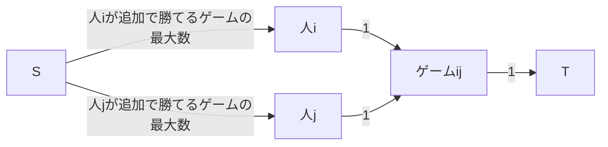

それぞれの人について「その人が優勝できるか」を独立に調べればよい。まず、その人がまだ行っていないゲームは全て勝つとしてよい。ここでその人が合計X回勝つとすると、残りの人はX-1回までしか勝てない、つまり追加で勝てるゲーム数が決まることに注意。

残りのゲームの結果は最大流で決める。まだ行われていないゲームについて以下のように辺を張り、全てのゲームの勝者が制約を満たしつつ決まる（最大流が残りゲームの数と等しくなる）ことを調べればよい。

